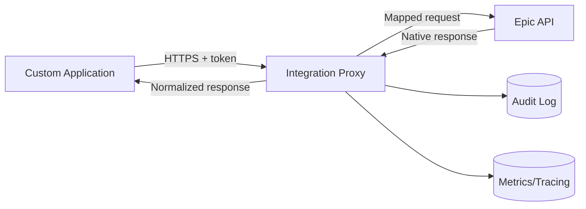

---
mb_meta:
  projectID: "epic-integration-proxy"
  version: "0.1.0"
  lastUpdated: "2026-03-08"
  templateVersion: "1.0"
  fileType: "systemPatterns"
---

# Epic Integration Proxy - System Patterns & Architecture

## Overall Architecture
### System Architecture Pattern
**Pattern**: Backend-for-backend integration proxy (adapter + anti-corruption layer)
**Rationale**: Isolates Epic-specific protocols/contracts from the application domain.

### High-Level System Diagram

### Key Architectural Principles
- Contract stability at the proxy boundary
- Security-first defaults and least privilege
- Observability by design (logs, metrics, traces)

## Component Architecture
### Core Components
#### API Gateway Layer
- **Purpose**: Receive, authenticate, authorize, and route inbound requests.
- **Responsibilities**: Token validation, policy checks, rate limiting, correlation IDs.
- **Dependencies**: Auth provider, policy config, routing rules.

#### Mapping/Orchestration Layer
- **Purpose**: Translate app contracts to Epic contracts and back.
- **Responsibilities**: Schema validation, field mapping, response normalization.
- **Dependencies**: Contract schemas, transformation rules, validation engine.

#### Integration Adapter Layer
- **Purpose**: Encapsulate Epic transport/client details.
- **Responsibilities**: HTTP client behavior, retries/timeouts, Epic error translation.
- **Dependencies**: Epic endpoint configuration, network controls, secret management.

### Component Relationships
Gateway enforces access and routes to orchestration. Orchestration transforms payloads and calls adapters. Adapters communicate with Epic and return normalized outcomes upstream.

## Design Patterns in Use
### Primary Patterns
#### Anti-Corruption Layer
- **Usage**: Separate internal app contract from Epic-specific contract.
- **Benefits**: Reduced coupling and safer upstream change absorption.
- **Implementation**: Dedicated request/response mapping modules per use case.

#### Adapter Pattern
- **Usage**: Encapsulate Epic API specifics behind stable interfaces.
- **Benefits**: Testable integration boundary and easier client replacement.
- **Implementation**: Per-domain Epic adapter clients with shared resilience policies.

### Supporting Patterns
- Circuit breaker and retry policy: Protect against transient upstream failures.
- Structured audit logging: Preserve immutable request lifecycle records.

## Data Architecture
### Data Flow Pattern
Synchronous request-response mediation with optional asynchronous audit/event emission.

### Data Storage Strategy
- **Primary Data Store**: Minimal operational metadata store (optional)
- **Caching Layer**: Short-lived cache for reference/config data where safe
- **Data Persistence**: No long-term PHI persistence unless explicitly required

### Data Models
#### ProxyRequestContext
Request metadata including correlation ID, actor, scopes, endpoint key, and timing.

#### IntegrationContractMapping
Versioned mapping definition from app contract to Epic contract and reverse normalization.

## Integration Patterns
### External Service Integration
- **Epic API**: Authenticated server-to-server API integration through controlled adapters.
- **Monitoring Stack**: Standardized metrics and tracing export from proxy runtime.

### API Design Patterns
- **API Style**: RESTful JSON proxy endpoints
- **Authentication**: OAuth2/JWT at proxy ingress + secure upstream credential flow
- **Error Handling**: Canonical error envelope with mapped upstream codes

## Key Technical Decisions
### Decision 1: Dedicated Proxy Boundary
- **Decision**: Route all Epic traffic through one proxy service.
- **Rationale**: Centralized governance and consistent integration behavior.
- **Alternatives Considered**: Direct app-to-Epic calls.
- **Trade-offs**: Additional hop latency in exchange for control and safety.

### Decision 2: Versioned Mapping Contracts
- **Decision**: Maintain explicit versioned request/response mappings.
- **Rationale**: Controlled evolution and safer backward compatibility.
- **Alternatives Considered**: Inline ad hoc transformations.
- **Trade-offs**: More upfront specification work, less production drift.

### Decision 3: Auditability First
- **Decision**: Enforce correlation IDs and structured audit events for every request.
- **Rationale**: Healthcare integrations require traceability and incident evidence.
- **Alternatives Considered**: Basic logs only.
- **Trade-offs**: More logging/storage overhead, much stronger operability.

## Quality Attributes
### Performance Requirements
- Keep proxy overhead predictable and low for synchronous user flows.
- Define explicit timeout budgets per endpoint and fail fast.

### Security Requirements
- Enforce least-privilege credentials and strict secret handling.
- Prevent sensitive data leakage in logs and error payloads.

### Scalability Requirements
- Stateless request handling to support horizontal scaling.
- Config-driven routing/mapping to add endpoints incrementally.

### Maintainability Requirements
- Domain-based adapter separation with clear contracts.
- High testability of mappings and error translation logic.

## Anti-Patterns to Avoid
- Direct client coupling to Epic contracts: increases migration and compliance risk.
- Unstructured logs for integration traffic: prevents reliable incident forensics.
- Business logic embedded in transport adapters: reduces clarity and testability.
